# KeyNginx CLI

🚀 **Automated SSL-enabled Nginx setup with Docker** - Generate certificates, configurations, and container orchestration in seconds.

## Quick Start

```bash
# Initialize a new project
keynginx init --domain myapp.local

# Just generate certificates
keynginx certs --domain localhost --out ./ssl

# Interactive setup
keynginx init --interactive
```

## What It Does

KeyNginx automates the tedious process of setting up secure web servers by generating:

- 🔐 **SSL Certificates** - Self-signed certificates for development
- ⚙️ **Nginx Configuration** - Production-ready configs with security headers  
- 🐳 **Docker Setup** - Complete container orchestration
- 🛡️ **Security Headers** - HSTS, CSP, XSS protection, and more

## Project Architecture


## Installation

```bash
# Clone and build
git clone <repo-url>
cd keynginx
make build

# Or install directly
make install
```

## Usage Examples

### Basic Project Setup
```bash
keynginx init --domain myapp.local --output ./myapp
cd myapp
docker-compose up -d
```

### Multi-Service Setup
```bash
keynginx init \
  --domain api.local \
  --services "frontend:3000:/,backend:8000:/api" \
  --custom-headers "X-API-Version:v2.0" \
  --security-level strict
```

### Certificate Generation Only
```bash
keynginx certs --domain localhost --key-size 4096 --validity 730
```

## Generated Project Structure

```
myapp/
├── ssl/
│   ├── private.key         # 🔑 SSL private key  
│   └── certificate.crt     # 📜 SSL certificate
├── nginx.conf              # ⚙️ Nginx configuration
├── docker-compose.yml      # 🐳 Container setup
├── keynginx.yaml          # 💾 Project settings
└── logs/                  # 📋 Nginx logs (created on run)
```

## Security Levels

| Level | Description | Use Case |
|-------|-------------|----------|
| **strict** | Maximum security, strict CSP | Production APIs |
| **balanced** | Good security + compatibility | Most web apps (default) |
| **permissive** | Basic headers only | Legacy applications |

## Features

### 🔐 SSL Certificate Generation
- RSA keys (2048, 3072, 4096 bits)
- Self-signed certificates with SAN support
- Localhost and custom domain support
- Proper file permissions (600 for private keys)

### ⚙️ Nginx Configuration  
- HTTP to HTTPS redirect
- Modern SSL/TLS configuration (TLS 1.2+)
- Gzip compression
- Security headers (HSTS, CSP, XSS protection)
- Health check endpoints
- Service reverse proxying

### 🐳 Docker Integration
- Multi-service container setup
- Persistent SSL certificates
- Log volume mounting
- Custom networks
- Ready-to-use compose files

## Command Reference

```bash
# Project initialization
keynginx init [flags]

# Certificate generation  
keynginx certs [flags]

# Get version info
keynginx version

# Help for any command
keynginx <command> --help
```

### Key Flags

| Flag | Description | Example |
|------|-------------|---------|
| `--domain` | Domain name | `--domain api.local` |
| `--services` | Service configs | `--services "app:3000:/,api:8000:/api"` |
| `--security-level` | Security profile | `--security-level strict` |
| `--interactive` | Interactive setup | `--interactive` |
| `--custom-headers` | Custom headers | `--custom-headers "X-Version:2.0"` |

## Workflow Diagram

```mermaid
sequenceDiagram
    participant User
    participant KeyNginx
    participant Docker
    participant Browser
    
    User->>KeyNginx: keynginx init --domain myapp.local
    KeyNginx->>KeyNginx: Generate SSL certificates
    KeyNginx->>KeyNginx: Create nginx.conf with security headers
    KeyNginx->>KeyNginx: Generate docker-compose.yml
    KeyNginx-->>User: ✅ Project created
    
    User->>Docker: docker-compose up -d
    Docker->>Docker: Start nginx container
    Docker->>Docker: Mount SSL certs & config
    Docker-->>User: 🚀 Server running
    
    User->>Browser: Visit https://localhost:8443
    Browser->>Docker: HTTPS request
    Docker-->>Browser: Secure response with headers
```



## Development Status

- ✅ **Phase 1**: Certificate generation
- ✅ **Phase 2**: Nginx configuration & project initialization  
- 🚧 **Phase 3**: Docker container management (coming soon)
- 📋 **Phase 4**: Advanced features & polish

## Requirements

- Go 1.21+
- Docker (for running generated projects)

## Contributing

```bash
# Setup development
make setup-dev

# Run tests  
make test

# Build and test
make example
```

## ⚠️ Important Notes

- **Development Use Only**: Generated certificates are self-signed
- **Production**: Use Let's Encrypt or proper CA certificates
- **Browser Warnings**: Self-signed certs will show security warnings

## License

MIT License - see LICENSE file for details.

---

**Built with ❤️ in Go** | **Powered by Nginx & Docker**