# KeyNginx CLI

🚀 **Complete SSL-enabled Nginx automation** - From certificates to running containers in one command.

[](https://golang.org)
[](https://docker.com)
[](LICENSE)

## Quick Start

```bash
# Create and start a complete project
keynginx init --domain myapp.local
cd keynginx-output
keynginx up

# 🌐 Visit https://localhost:8443
```

## What KeyNginx Does

KeyNginx eliminates the tedious process of setting up secure development servers by automating:

- 🔐 **SSL Certificate Generation** - Self-signed certificates with proper SAN support
- ⚙️ **Nginx Configuration** - Production-ready configs with security headers  
- 🐳 **Docker Orchestration** - Complete container lifecycle management
- 🛡️ **Security Headers** - HSTS, CSP, XSS protection, and more
- 🔄 **Service Proxying** - Multi-service reverse proxy configuration

## Project Architecture

```mermaid
graph TD
    A[keynginx init] --> B[Generate SSL Certs]
    A --> C[Create Nginx Config]
    A --> D[Generate Docker Compose]
    A --> E[Save Project Config]
    
    B --> F[ssl/private.key]
    B --> G[ssl/certificate.crt]
    
    C --> H[nginx.conf]
    C --> I[Security Headers]
    C --> J[Service Proxies]
    
    D --> K[docker-compose.yml]
    D --> L[Container Networks]
    
    E --> M[keynginx.yaml]
    
    F --> N[keynginx up]
    G --> N
    H --> N
    K --> N
    M --> N
    
    N --> O[🚀 Running HTTPS Server]
```



## Features

### 🔐 SSL Certificate Management
- RSA key generation (2048, 3072, 4096 bits)
- Self-signed certificates with SAN support
- Localhost and custom domain support
- Proper file permissions (600 for private keys)
- Certificate validation and expiry checking

### ⚙️ Advanced Nginx Configuration  
- HTTP to HTTPS automatic redirect
- Modern TLS 1.2/1.3 configuration
- Gzip compression optimization
- Comprehensive security headers
- Health check endpoints
- Multi-service reverse proxy support

### 🐳 Complete Docker Integration
- Container lifecycle management (create, start, stop, remove)
- Real-time status monitoring
- Log streaming and management
- Automatic port mapping
- Volume mounting for SSL and configs
- Health checks and readiness probes

### 🛡️ Security Profiles
| Profile | Use Case | Features |
|---------|----------|----------|
| **Strict** | Production APIs | Maximum security, strict CSP, HSTS preload |
| **Balanced** | Most web apps | Good security + compatibility (default) |
| **Permissive** | Legacy apps | Basic headers, maximum compatibility |

## Installation

### Prerequisites
- Go 1.21 or later
- Docker Desktop or Docker Engine
- Git (for cloning)

### Build from Source
```bash
# Clone the repository
git clone https://github.com/sinhaparth5/keynginx
cd keynginx

# Install dependencies
go mod download

# Build
make build

# Install globally (optional)
make install
```

### Verify Installation
```bash
# Check KeyNginx version
./dist/keynginx version

# Verify Docker is available
docker --version
docker ps
```

## Complete Command Reference

### Project Management
```bash
# Initialize new project
keynginx init [flags]

# Start containers
keynginx up [flags]

# Stop and remove containers  
keynginx down [flags]

# Check project status
keynginx status [flags]

# View container logs
keynginx logs [flags]
```

### Certificate Operations
```bash
# Generate certificates only
keynginx certs [flags]

# Validate existing certificates
keynginx certs --validate /path/to/cert.crt
```

### Information Commands
```bash
# Show version information
keynginx version

# Get help for any command
keynginx <command> --help
```

## Usage Examples

### Basic Project Setup
```bash
# Simple localhost setup
keynginx init --domain localhost
cd keynginx-output
keynginx up

# Custom domain
keynginx init --domain myapp.local --output ./myapp
cd myapp
keynginx up
```

### Multi-Service Application
```bash
# API with frontend and backend services
keynginx init \
  --domain api.local \
  --services "frontend:3000:/,backend:8000:/api" \
  --custom-headers "X-API-Version:v2.0,X-Environment:development" \
  --security-level strict \
  --output ./api-project

cd api-project
keynginx up

# Check everything is running
keynginx status

# View real-time logs
keynginx logs -f
```

### Certificate Management
```bash
# Generate high-security certificates
keynginx certs \
  --domain secure.local \
  --key-size 4096 \
  --validity 730 \
  --country US \
  --state CA \
  --organization "My Company" \
  --out ./secure-certs

# Validate certificates
keynginx certs --validate ./secure-certs/certificate.crt
```

### Container Management
```bash
# Start with recreate
keynginx up --recreate

# Stop without removing
keynginx down --remove=false

# Check all KeyNginx containers
keynginx status --all

# View logs (last 50 lines)
keynginx logs --tail 50
```

## Generated Project Structure

```
myapp/
├── ssl/
│   ├── private.key         # 🔑 SSL private key (600 permissions)
│   └── certificate.crt     # 📜 SSL certificate (644 permissions)
├── nginx.conf              # ⚙️ Production-ready Nginx config
├── docker-compose.yml      # 🐳 Container orchestration  
├── keynginx.yaml          # 💾 Project configuration
└── logs/                  # 📋 Nginx access/error logs (created on run)
```

## Configuration Reference

### Security Levels

#### Strict (Production APIs)
```yaml
security:
  level: strict
  enable_hsts: true
  hsts_max_age: 63072000  # 2 years
  enable_csp: true
  csp_policy: "default-src 'self'; script-src 'self';"
```

#### Balanced (Default)
```yaml
security:
  level: balanced
  enable_hsts: true
  hsts_max_age: 31536000  # 1 year
  enable_csp: true
  csp_policy: "default-src 'self'; script-src 'self' 'unsafe-inline';"
```

#### Permissive (Legacy Apps)
```yaml
security:
  level: permissive
  enable_hsts: false
  enable_csp: false
```

### Service Configuration
```yaml
nginx:
  services:
    - name: frontend
      port: 3000
      path: /
      proxy_pass: http://frontend:3000
    - name: backend
      port: 8000
      path: /api
      proxy_pass: http://backend:8000
```

## Workflow Diagram

```mermaid
sequenceDiagram
    participant Dev as Developer
    participant KeyNginx
    participant Docker
    participant Browser
    
    Dev->>KeyNginx: keynginx init --domain myapp.local
    KeyNginx->>KeyNginx: Generate SSL certificates
    KeyNginx->>KeyNginx: Create nginx.conf with security headers
    KeyNginx->>KeyNginx: Generate docker-compose.yml
    KeyNginx-->>Dev: ✅ Project created in ./keynginx-output/
    
    Dev->>KeyNginx: cd keynginx-output && keynginx up
    KeyNginx->>Docker: Create nginx container
    KeyNginx->>Docker: Mount SSL certs & config
    KeyNginx->>Docker: Start container on port 8443
    Docker-->>KeyNginx: Container running
    KeyNginx-->>Dev: 🚀 Server ready at https://localhost:8443
    
    Dev->>Browser: Visit https://localhost:8443
    Browser->>Docker: HTTPS request
    Docker->>Docker: Nginx processes request
    Docker-->>Browser: Secure response with headers
    
    Dev->>KeyNginx: keynginx status
    KeyNginx->>Docker: Get container info
    Docker-->>KeyNginx: Container status
    KeyNginx-->>Dev: 📊 Status: running, ports, URLs
    
    Dev->>KeyNginx: keynginx logs -f
    KeyNginx->>Docker: Stream container logs
    Docker-->>Dev: 📋 Real-time nginx logs
    
    Dev->>KeyNginx: keynginx down
    KeyNginx->>Docker: Stop & remove container
    Docker-->>KeyNginx: Container stopped
    KeyNginx-->>Dev: ✅ Server stopped
```



## Command Flag Reference

### Global Flags
| Flag | Short | Description | Default |
|------|-------|-------------|---------|
| `--verbose` | `-v` | Verbose output | `false` |
| `--quiet` | `-q` | Quiet mode | `false` |
| `--config` | | Custom config file | `~/.keynginx.yaml` |

### keynginx init
| Flag | Description | Default | Example |
|------|-------------|---------|---------|
| `--domain` `-d` | Domain name | `localhost` | `--domain api.local` |
| `--output` `-o` | Output directory | `./keynginx-output` | `--output ./myapp` |
| `--interactive` `-i` | Interactive mode | `false` | `--interactive` |
| `--security-level` | Security profile | `balanced` | `--security-level strict` |
| `--https-port` | HTTPS port | `8443` | `--https-port 443` |
| `--http-port` | HTTP port | `8080` | `--http-port 80` |
| `--services` | Service configs | | `--services "app:3000:/,api:8000:/api"` |
| `--custom-headers` | Custom headers | | `--custom-headers "X-Version:2.0"` |
| `--overwrite` | Overwrite existing | `false` | `--overwrite` |

### keynginx up
| Flag | Description | Default |
|------|-------------|---------|
| `--project` `-p` | Project directory | `.` |
| `--detach` `-d` | Run in background | `true` |
| `--recreate` | Recreate containers | `false` |

### keynginx down
| Flag | Description | Default |
|------|-------------|---------|
| `--project` `-p` | Project directory | `.` |
| `--remove` | Remove containers | `true` |
| `--force` | Force stop | `false` |

### keynginx logs
| Flag | Description | Default |
|------|-------------|---------|
| `--project` `-p` | Project directory | `.` |
| `--follow` `-f` | Follow logs | `false` |
| `--tail` | Lines from end | `100` |

### keynginx certs
| Flag | Description | Default |
|------|-------------|---------|
| `--domain` `-d` | Domain name | `localhost` |
| `--out` `-o` | Output directory | `./ssl` |
| `--key-size` | RSA key size | `2048` |
| `--validity` | Days valid | `365` |
| `--country` | Country code | `US` |
| `--organization` | Organization | `KeyNginx Generated` |

## Development & Testing

### Development Setup
```bash
# Setup development environment
make setup-dev

# Run all tests
make test

# Format code
make fmt

# Check Docker availability
make docker-check
```

### Testing Workflow
```bash
# Test complete workflow
make test-workflow

# Test individual features
make test-up
make test-status
make test-logs

# Clean up test projects
make clean-tests
```

### Building
```bash
# Build for current platform
make build

# Build for all platforms
make build-all

# Create release
make release
```

## Troubleshooting

### Common Issues

#### Docker Not Available
```bash
# Check Docker status
docker --version
docker ps

# Start Docker Desktop (macOS/Windows)
# or start Docker daemon (Linux)
sudo systemctl start docker
```

#### Port Already in Use
```bash
# Check what's using the port
lsof -i :8443

# Use different ports
keynginx init --https-port 9443 --http-port 9080
```

#### Container Won't Start
```bash
# Check container logs
keynginx logs

# Recreate container
keynginx down
keynginx up --recreate

# Check nginx config syntax
docker run --rm -v $(pwd)/nginx.conf:/etc/nginx/nginx.conf:ro nginx nginx -t
```

#### SSL Certificate Issues
```bash
# Validate certificates
keynginx certs --validate ./ssl/certificate.crt

# Regenerate certificates
keynginx certs --domain yourdomain.local --out ./ssl --overwrite
```

### Getting Help

1. **Check command help**: `keynginx <command> --help`
2. **Enable verbose output**: `keynginx --verbose <command>`
3. **Check container logs**: `keynginx logs -f`
4. **Verify project status**: `keynginx status --json`

## Security Considerations

### Development vs Production

**⚠️ Important Security Notes:**

- **Self-signed certificates**: Generated certificates are for **development only**
- **Browser warnings**: Users will see security warnings for self-signed certificates
- **Production deployment**: Use Let's Encrypt or commercial certificates for production
- **Local development**: Perfect for local development and testing environments

### Generated Security Headers

KeyNginx automatically includes modern security headers:

```nginx
# Always included
X-Server-Created-By: keynginx
X-Content-Type-Options: nosniff

# Security level dependent
X-Frame-Options: SAMEORIGIN|DENY
X-XSS-Protection: 1; mode=block
Strict-Transport-Security: max-age=31536000
Content-Security-Policy: [configurable]
Referrer-Policy: strict-origin-when-cross-origin
```

### File Permissions

KeyNginx sets proper file permissions:
- Private keys: `600` (owner read/write only)
- Certificates: `644` (world readable)
- Config files: `644` (world readable)

## Contributing

We welcome contributions! Please see [CONTRIBUTING.md](CONTRIBUTING.md) for guidelines.

### Development Process
1. Fork the repository
2. Create a feature branch
3. Make your changes
4. Add tests if applicable
5. Run `make test` and `make fmt`
6. Submit a pull request

### Reporting Issues
Please use the [GitHub issue tracker](https://github.com/sinhaparth5/keynginx/issues) to report bugs or request features.

## Roadmap

### Current Version (1.0.0)
- ✅ SSL certificate generation
- ✅ Nginx configuration with security headers
- ✅ Docker container management
- ✅ Multi-service reverse proxy
- ✅ Real-time logging and monitoring

### Future Releases

#### v1.1.0 - Enhanced Security
- 🔄 Let's Encrypt integration
- 🔄 Certificate auto-renewal
- 🔄 Advanced rate limiting
- 🔄 WAF (Web Application Firewall) rules

#### v1.2.0 - Advanced Features
- 🔄 Load balancing support
- 🔄 Health check configurations
- 🔄 Monitoring and metrics
- 🔄 Configuration templates

#### v1.3.0 - Cloud Integration
- 🔄 Cloud provider integration
- 🔄 Kubernetes manifests
- 🔄 CI/CD pipeline templates
- 🔄 Infrastructure as Code

## License

This project is licensed under the MIT License - see the [LICENSE](LICENSE) file for details.

## Acknowledgments

- **Nginx** - High-performance web server
- **Docker** - Containerization platform
- **Cobra** - CLI framework for Go
- **Go Community** - Amazing language and ecosystem

---

**Built with ❤️ in Go** | **Powered by Nginx & Docker** | **Made for Developers**

> "From zero to HTTPS in 30 seconds" ⚡

---

## Quick Links

- 📚 [Documentation](https://github.com/sinhaparth5/keynginx/wiki)
- 🐛 [Issues](https://github.com/sinhaparth5/keynginx/issues)
- 💬 [Discussions](https://github.com/sinhaparth5/keynginx/discussions)
- 🚀 [Releases](https://github.com/sinhaparth5/keynginx/releases)
- 🏗️ [Examples](https://github.com/sinhaparth5/keynginx/tree/main/examples)